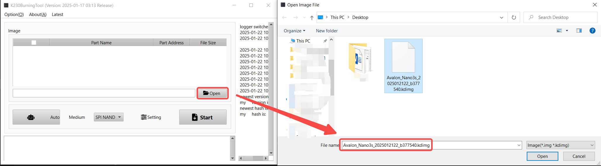
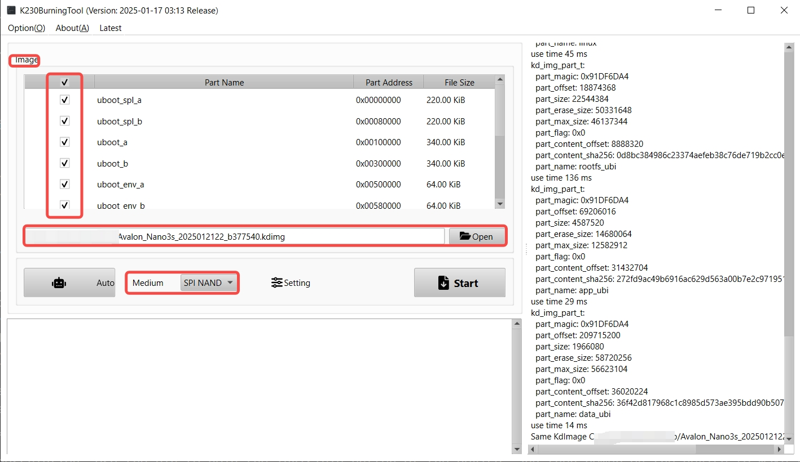
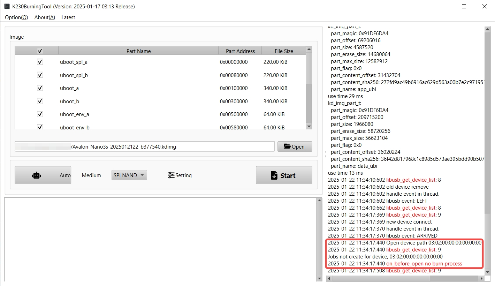
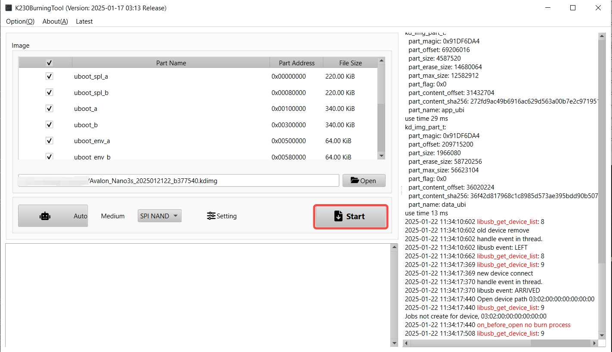
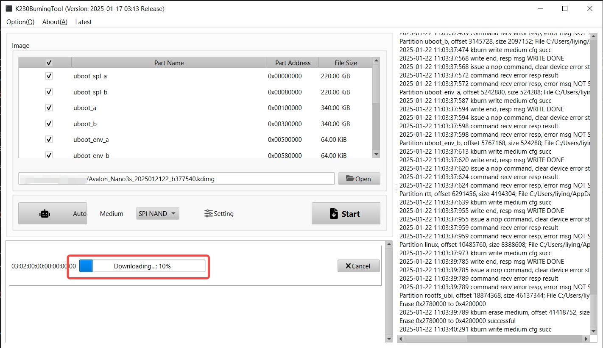
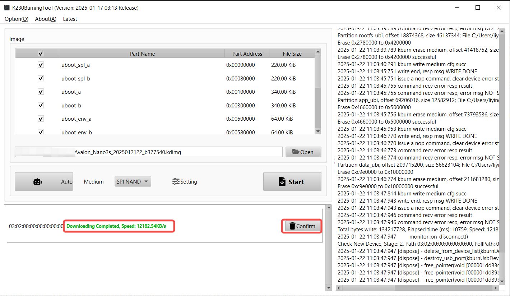

## 1. Overview
Here is the network service layer source code of nano3s.

## 2. Building
### 2.1 Basic packages and tools install
It is recommended to build on Ubuntu 18.04 or Ubuntu 20.04.
```shell
sudo apt-get install git wget cmake tar gcc g++ libconfuse-dev mtd-utils mtools
```

### 2.2 Build
Download code. 
```shell
git clone git@github.com:Canaan-Creative/Avalon_Nano3s.git
```
Build.
```shell
cd Avalon_Nano3s
scripts/build
```
You will be prompted with the following message.
Select the correct model information and enter the desired version num. as shown below:
```shell
[INFO] Please select Model [n]
(0) NANO3S

Your Choice [0]: 
[INFO] Model: NANO3S

[INFO] CPU: k230

[INFO] Please input version num [nn]: 22

[INFO] CGminer Version 22

[INFO] CGminer release level 0

```

This compilation process will take a few minutes, and if everything goes well, you should see the following files in output directory.
```shell
output/
├── Avalon_Nano3s_2025012122_b377540.kdimg.gz          # spinand flash image gz package
├── Avalon_Nano3s_USB_2025012122_b377540.aup.img.gz    # udisk image gz package
```
Note: Put the image gz package file you made where you want to use it.

## 3. Imges Burning
### 3.1 Flash image
Avalon_Nano3s_2025012122_b377540.kdimg.gz is used to update the system image of the nano3s device, which is burned using the burning tool.
Note: Please decompress the image before burning. Examples use the decompress tool to decompress as: Avalon_Nano3s_2025012122_b377540.kdimg
#### 3.1.1 Burning Under Windows
1) Download tools: If you don't have the tools, please download them first(burn_tool download address: `https://kendryte-download.canaan-creative.com/k230/downloads/burn_tool/v2.1.0/K230BurningTool-Windows-v2.1.0-0-gd24909e.zip`). If you have the tools, ignore this step.

2) Decompression tools: Unzip K230BurningTool-Windows-v2.1.0-0-gd24909e.zip

3) Tools use method: Execute K230BurningTool.exe. Click open button and select Avalon_Nano3s_2025012122_b377540.kdimg, Image part name select all, Medium select SPI NAND.



4) Details description: Unplug the Wi-Fi Receiver module,use double type A wire to link the nano3s and pc, then use the pin to hold the invisible button of the device, and then power on the device to make the nano3s enter the burn mode. 
Take the burn photo as shown below:

Note: You can be prompted to enter burn mode by observing the debug box on the right of the tool.


5) Click Start button to burn: this process will take a few minutes, when Downloading Completed appears means burn success.




After the upgrade is completed, your nano3s system has been changed to your own system, which has root privileges. 
Please plug the Wi-Fi Receiver module and power the nano3s back on.

### 3.2 Udisk image
Avalon_Nano3s_USB_2025012122_b377540.aup.img.gz is Udisk upgrade images, only support on nano3s with sysimage build by yourself! 
#### 3.2.1 Burning Under Windows
Under Windows, you can use the Rufus tool to burn the TF card (Rufus tool download address: `http://rufus.ie/downloads/`).
Please refer to the instructions:"docs/Nano3s Udisk upgrade instructions.docx" for details.

## Enjoy the Nano3s development journey.
